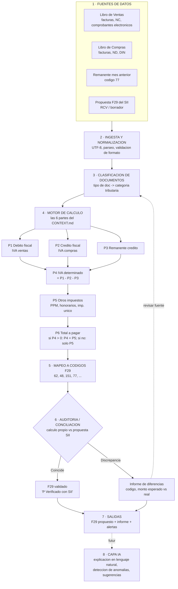

# AuditAI — Arquitectura del sistema (tentativa)

> Estado: **fase de diseño**. Este documento describe el sistema objetivo, no lo ya construido.
> Fuentes de verdad actuales del dominio: [`../CONTEXT.md`](../CONTEXT.md), [`../PRUEBA1.xlsx`](../PRUEBA1.xlsx) (hoja `CLIENTE1`) y [`../F29.pdf`](../F29.pdf) (Formulario 29 oficial del SII).

## Meta final

Construir un asistente que **lea los datos contables de una empresa, calcule la declaración mensual de IVA/PPM/retenciones (Formulario 29 del SII de Chile), la mapee a los códigos oficiales y la audite contra la propuesta del SII**, marcando automáticamente cualquier discrepancia. El objetivo es reducir el trabajo manual del contador y disminuir errores en la declaración.

## Diagrama de flujo del sistema

> Para ver el diagrama renderizado: abre este archivo en VS Code y usa la **Vista previa de Markdown** (Ctrl+Shift+V). VS Code renderiza Mermaid de forma nativa.

## Por qué cada etapa

| # | Etapa | Por qué existe |
|---|-------|----------------|
| 1 | **Fuentes de datos** | El F29 se arma desde los libros de compra/venta + el remanente del período anterior (código 77) + la propuesta del SII. Sin separar fuentes, no se puede auditar (auditar = comparar dos orígenes independientes). |
| 2 | **Ingesta y normalización** | Los datos llegan en CSV/Excel con codificaciones inconsistentes (el `PRUEBA1.csv` ya muestra caracteres rotos: `mi�rcoles`, `N�`). Hay que estandarizar a UTF-8 y validar formato antes de calcular, o el resto del sistema hereda basura. |
| 3 | **Clasificación de documentos** | Cada documento (factura de venta, nota de crédito, factura de compra, nota de débito, DIN, comprobante electrónico) entra en una casilla distinta del F29. Es el paso que traduce "qué documento es" a "dónde suma en el formulario". |
| 4 | **Motor de cálculo (6 partes)** | Es el corazón: replica en código la lógica de la planilla descrita en `CONTEXT.md`. Aísla las reglas tributarias para poder probarlas y mantenerlas sin tocar ingesta ni salida. |
| 5 | **Mapeo a códigos F29** | El SII no entiende "TOTAL IVA VENTAS"; entiende códigos (62 = PPM neto, 48 = ret. impuesto único, 151 = ret. honorarios, 77 = remanente). Este es el puente entre la planilla simplificada y los ~140 códigos del formulario oficial. |
| 6 | **Auditoría / conciliación** | El valor diferencial del proyecto. Compara el cálculo propio contra la propuesta del SII (la nota `"P Verificado con la propuesta del SII"` del Excel ya hace esto a mano). Si no coincide, devuelve al paso 3 para revisar el documento culpable. |
| 7 | **Salidas** | Entrega utilizable: F29 propuesto, informe de discrepancias y alertas. |
| 8 | **Capa IA (futuro)** | Donde "AuditAI" justifica la "AI": explicar en lenguaje natural por qué hay una diferencia, detectar anomalías (ej. una factura atípica) y sugerir correcciones. |

## El motor de cálculo, en detalle (validado con el ejemplo `CLIENTE1`)

| Parte | Regla | Celdas Excel | Resultado ejemplo |
|-------|-------|--------------|-------------------|
| P1 · Débito fiscal | Σ IVA de documentos emitidos | `=SUM(D9:D11)` | $462 |
| P2 · Crédito fiscal | −Σ IVA de documentos recibidos | `=-SUM(D13:D15)` | −$260.143 |
| P3 · Remanente | Remanente del período anterior (cód. 77) | `=+G10*-1` | −$158.117 |
| P4 · IVA determinado | P1 + P2 + P3 | `=+E12+E16+E17` | −$417.798 ⇒ remanente, no se paga IVA |
| P5 · Otros impuestos | PPM = (ventas netas)·tasa; + honorarios + imp. único | `=C23*D23` | $3 (PPM) |
| P6 · Total a cancelar | **Si P4 > 0:** P4 + P5; **si P4 ≤ 0:** solo P5 | `=SUM(E23:E25)` | $3 |

La regla condicional de P6 es la clave fácil de equivocar: cuando hay remanente (P4 negativo), el IVA **no** resta de los otros impuestos; estos se pagan igual. El motor debe codificar ese `if` explícitamente.

## Principios de diseño

- **Separación ingesta → cálculo → salida**: las reglas tributarias cambian (leyes nuevas); aislarlas evita reescribir todo.
- **El cálculo es determinista; la IA es opcional**: el número del F29 debe salir de reglas verificables, no de un modelo. La IA explica y detecta, no decide el monto.
- **Auditable por diseño**: cada cifra de salida debe poder rastrearse hasta los documentos de origen.
