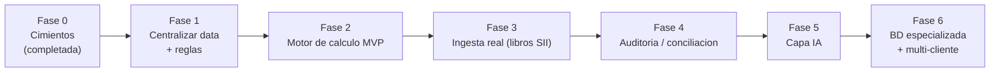

# AuditAI — Hoja de ruta (metas y pasos hasta la meta final)

Meta final: ver [`ARQUITECTURA.md`](ARQUITECTURA.md). Cada fase produce algo funcional y verificable; no se avanza a la siguiente sin cumplir el "criterio de aceptación".

> 🔁 **Cambio de rumbo (30-jun-2026, acordado con el cliente).** La prioridad pasó a **centralizar toda la data** desde el inicio, para operar como asesoría contable data-driven. La centralización es en **dos etapas**: primero en **Notion** (recuperar y completar la página "General Customers Data"), y luego migrar a una **BD especializada** (Supabase/PostgreSQL). Esto **adelanta** la persistencia (antes prevista en la Fase 6) y suma una etapa de **ingesta automatizada** (Notion → SII → descarga del XLSX) al frente del flujo. Detalle en [`dev/07-flujo-de-datos.md`](dev/07-flujo-de-datos.md) y decisiones D11–D16 de [`dev/05-decisiones-y-preguntas.md`](dev/05-decisiones-y-preguntas.md). Las fases de abajo **ya reflejan** ese reordenamiento (centralización en la Fase 1, BD especializada en la Fase 6); el desglose ejecutable está en [`dev/11-checklist-maestro.md`](dev/11-checklist-maestro.md).

> ✅ **Avance 30-jun-2026:** red de seguridad montada en Notion (plan Business / historial 90d / papelera 30d), snapshot CSV base en `backups/general-customers-data/2026-06-30_all.csv` (171 registros) y sandbox `General Customers Data - AuditAI` creada (copia fiel, 171 filas). Se identificaron **3 fuentes auxiliares** (Contable Mayo, RRHH Junio 2026, Tickets - Servicios) de donde recuperar la data faltante. Protocolos en [`dev/09-seguridad-y-respaldo.md`](dev/09-seguridad-y-respaldo.md) y [`dev/10-fuentes-auxiliares-notion.md`](dev/10-fuentes-auxiliares-notion.md).

---

## Fase 0 — Cimientos *(completada 30-jun-2026)*
**Objetivo:** tener un caso real de referencia y entender el dominio.
- [x] Caso de ejemplo (`PRUEBA1.xlsx` / hoja `CLIENTE1`).
- [x] Descripción de la lógica (`CONTEXT.md`).
- [x] Formulario oficial de referencia (`F29.pdf`).
- [x] Documentación de arquitectura y roadmap (este `docs/`).
- [x] Conexión Notion (MCP + API) y mapeo de "General Customers Data" (171 clientes).
- [x] Red de seguridad: plan Business confirmado, snapshot CSV base (`backups/general-customers-data/2026-06-30_all.csv`), sandbox `General Customers Data - AuditAI` (copia fiel).
- [x] Protocolo de seguridad/respaldo (`dev/09`) y fuentes auxiliares identificadas (`dev/10`).
- [x] Inicializar repositorio git para versionar el avance (rama `main`).
- [x] Añadir `.gitignore` que excluya `backups/` (contiene credenciales/PII) + `.gitattributes`.

**Criterio de aceptación:** cualquier persona nueva entiende el objetivo leyendo `docs/`. ✅ (cumplido)

## Fase 1 — Centralizar la data + formalizar las reglas
> 🔁 Reordenada por el cambio de rumbo (30-jun-2026): la centralización de datos (antes en fases posteriores) se pliega aquí. Ver D11 y el desglose en [`dev/11-checklist-maestro.md`](dev/11-checklist-maestro.md) (tareas 1.1–1.6).

**Objetivo:** recuperar/completar la base central en Notion (Etapa 1 de D11) y convertir el conocimiento implícito de las fórmulas de Excel en una especificación explícita.

> ⛔ **Secuencial, no en paralelo (D18):** el **Frente A (base de datos)** se completa al 100% y se verifica **antes** de iniciar el **Frente B (reglas)**. La base de datos es la prioridad. Detalle en [`dev/12-fase1-plan-detallado.md`](dev/12-fase1-plan-detallado.md).

*Frente A — PRIMERO · Centralizar la data (Etapa 1 · Notion):*
- [ ] Mapear el esquema de las 3 fuentes auxiliares (Contable Mayo, RRHH Junio 2026, Tickets - Servicios).
- [ ] Cruzarlas con la sandbox y volcar la **data faltante** (dry-run + confirmación; nunca al original).
- [ ] Validar, deduplicar y verificar → **gate:** base final y robusta antes de pasar al Frente B.

*Frente B — DESPUÉS (solo al cerrar el Frente A) · Formalizar las reglas:*
- [ ] Documentar las 6 partes como reglas (entradas, fórmula, salida) — ya esbozado en `ARQUITECTURA.md`.
- [ ] Construir el **diccionario de códigos F29** (código → significado → de qué documento sale). Hay ~140 códigos en `F29.pdf`; empezar por los que usa `CLIENTE1`: 62, 48, 151, 77, y los de IVA débito/crédito.
- [ ] Definir el catálogo de tipos de documento y a qué casilla mapea cada uno.

**Criterio de aceptación:** primero la base de datos queda completa, verificada y robusta (Frente A); luego un desarrollador puede implementar el cálculo sin abrir el Excel (Frente B).

## Fase 2 — Motor de cálculo (MVP)
**Objetivo:** reproducir la planilla en código, sin intervención manual.
- [ ] Script (Python sugerido) que toma un libro de ventas + libro de compras + remanente y devuelve las 6 partes.
- [ ] Implementar explícitamente la regla condicional de P6 (si P4 ≤ 0, solo se suma P5).
- [ ] Pruebas automáticas usando `CLIENTE1` como *golden test*: el total debe dar **$3** y el remanente **−$158.117**.

**Criterio de aceptación:** el script reproduce el resultado de `CLIENTE1` exactamente.

## Fase 3 — Ingesta real de datos del SII
**Objetivo:** dejar de tipear datos a mano.
- [ ] Parsear el **Registro de Compras y Ventas (RCV)** que exporta el SII (CSV).
- [ ] Normalización robusta (UTF-8, separador `;`, formatos de monto y fecha chilenos).
- [ ] Validaciones: documentos duplicados, montos negativos inesperados, tipos desconocidos.

**Criterio de aceptación:** se carga un RCV real y el motor calcula sin edición manual.

## Fase 4 — Auditoría / conciliación
**Objetivo:** el núcleo de "Audit" en AuditAI.
- [ ] Cargar la propuesta del F29 del SII.
- [ ] Comparar cálculo propio vs propuesta, código por código.
- [ ] Informe de discrepancias: código, monto esperado, monto SII, diferencia y documento probable causante.

**Criterio de aceptación:** ante una diferencia inyectada a propósito, el sistema la detecta y la localiza.

## Fase 5 — Capa IA
**Objetivo:** el "AI" de AuditAI.
- [ ] Explicación en lenguaje natural de cada discrepancia ("la diferencia en el código 77 viene de un remanente no arrastrado").
- [ ] Detección de anomalías (facturas atípicas, saltos de patrón mes a mes).
- [ ] Sugerencias de corrección.

**Criterio de aceptación:** el sistema explica una discrepancia de forma que un contador la acepte sin revisar el cálculo a mano.

## Fase 6 — BD especializada y producto multi-cliente
**Objetivo:** pasar de prototipo a herramienta usable y migrar a un almacén especializado.
- [ ] **Migración a BD especializada (Etapa 2 de D11):** decidir tecnología (Supabase / PostgreSQL u otra) y migrar desde Notion reutilizando la capa de acceso a datos, sin reescribir el motor.
- [ ] Soporte multi-empresa (hoy la hoja se llama `CLIENTE1`: la intención multi-cliente ya está en el diseño).
- [ ] Historial mensual y arrastre automático del remanente.
- [ ] Interfaz (web o de escritorio) y, eventualmente, integración con la API del SII.

**Criterio de aceptación:** un contador gestiona varios clientes y períodos sin tocar planillas, con la data en una BD especializada.

---

## Riesgos y decisiones abiertas
- **Cambios legales:** las tasas y códigos del F29 cambian con nuevas leyes; el diccionario de códigos debe ser fácil de actualizar.
- **Calidad de datos del SII:** codificación y formatos inconsistentes (ya visible en `PRUEBA1.csv`).
- **Alcance de la IA:** decidir explícitamente que la IA *no* determina montos (solo explica/detecta), para mantener el cálculo auditable.
- **¿Qué stack?** Python encaja bien (pandas para libros, pytest para los golden tests). Pendiente confirmar.
