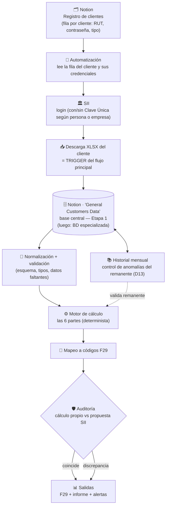

# 07 · Flujo de datos y centralización (cambio de rumbo)

> Documento dedicado (principio de granularidad **D3**). Desarrolla las decisiones **D11** (base de datos / centralización), **D12** (ingesta automatizada) y **D13** (anomalía del remanente) de [`05-decisiones-y-preguntas.md`](05-decisiones-y-preguntas.md).
>
> **Contexto:** el proyecto dio un giro de prioridad acordado con el cliente: el centro de gravedad pasa de "solo calcular el F29" a **centralizar toda la data posible en una base de datos**, para operar como una **asesoría contable data-driven**. Este documento detalla y **actualiza** la etapa de "fuentes de datos" de [`../ARQUITECTURA.md`](../ARQUITECTURA.md).

## El flujo de extremo a extremo

## 1. Origen: registro de clientes en Notion (D12)

- En **Notion** existe una tabla/base con **una fila por cliente**.
- De esa fila se extraen las **credenciales** del cliente: columnas **`RUT`** y **`contraseña`** (Clave Única).
- El acceso al SII se hace **con o sin Clave Única** según el cliente sea **persona** o **empresa**.

> ⚠️ **Algoritmo incompleto.** El creador describió el inicio y el final del flujo ("…algunos pasos más…"); faltan los pasos intermedios y la estructura exacta de la tabla en Notion. Pendiente de detallar (ver Preguntas abiertas en [`05`](05-decisiones-y-preguntas.md)).

## 2. Automatización: descarga del XLSX (el trigger)

La automatización inicia sesión en el SII y **descarga el XLSX del cliente**. Ese archivo es el **consumo primario del sistema** — el alimento / input que **gatilla el flujo principal**. Formatos soportados: **`.xlsx` y `.csv`** (D7).

## 3. Centralización en dos etapas (D11 · el nuevo núcleo)

Todo lo descargado y calculado se **centraliza**, pero en **dos etapas** (D11):

- **Etapa 1 — Notion "General Customers Data" (ahora).** Notion es la base central por ahora, porque es donde el cliente ya guarda, inyecta y extrae su data (en distintas hojas). Tarea inmediata: **recuperar y actualizar** esa página (hoy desactualizada y con datos faltantes) y **automatizar la integración** hacia ella. La conexión a Notion (API / MCP) está descrita en **D14**.
- **Etapa 2 — BD especializada (después).** Cuando todo esté centralizado en Notion, migrar a **Supabase / PostgreSQL** u otra. *Se discutirá más adelante.*
- **Recomendación:** acceder a Notion mediante una **capa de abstracción de datos** para que el salto de Etapa 1 → 2 no obligue a reescribir el resto del sistema.
- **Rol (en ambas etapas):** fuente única de la verdad de clientes, períodos, libros de compra/venta, F29 históricos y remanentes; habilita el historial para el control de anomalías (D13) y futuras analíticas.

## 4. Procesamiento (sin cambios respecto a la arquitectura base)

Desde la BD, el flujo continúa como ya estaba definido: **normalización/validación → motor de cálculo (6 partes) → mapeo a códigos F29 → auditoría contra el SII → salidas**. La novedad es que ahora **lee y escribe contra la base de datos central**, no contra archivos sueltos.

## 5. Control del remanente con el historial (D13)

El historial mensual almacenado en la BD permite verificar el remanente: se acepta la variación **natural** (ligada a la UTM) y solo se **alerta ante cambios bruscos y atípicos**. Sin umbral porcentual fijo.

## 🔐 Nota de seguridad: credenciales de clientes

Este flujo maneja **credenciales sensibles de terceros** (RUT + Clave Única). Debe tratarse con cuidado desde el día 1:

- **No** almacenar contraseñas en texto plano; usar **cifrado en reposo** y, idealmente, un **gestor de secretos** en lugar de dejarlas crudas en Notion.
- **Mínimo privilegio**: solo el componente de automatización accede a las credenciales.
- **Autorización del cliente**: operar las cuentas del SII de cada cliente requiere su consentimiento explícito (práctica habitual en asesorías contables).
- Registrar **quién/cuándo** se accede (trazabilidad).

> Este punto está abierto y debe definirse antes de manejar credenciales reales (ver Preguntas abiertas en [`05`](05-decisiones-y-preguntas.md)).

---

**Anterior:** [`06-stack-tecnico.md`](06-stack-tecnico.md) · **Volver al** [`README`](README.md)
