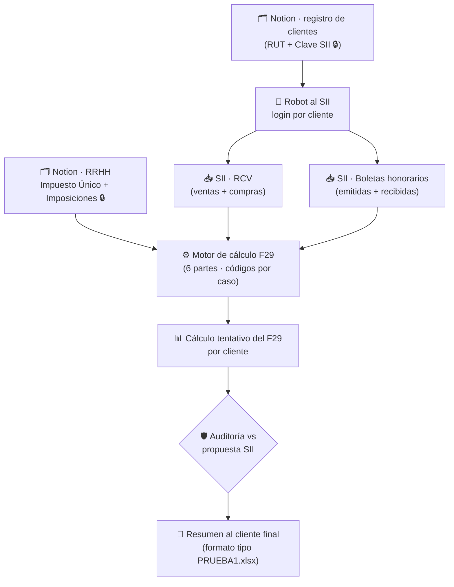

# 16 · Frente B — Plan de cálculo tentativo del F29 por cliente

> **Documento de planificación (NO de ejecución).** Define cómo se construirá el **cálculo tentativo del Formulario 29 de cada cliente**, que será la base de la automatización principal. Pensado para **presentar al cliente (la asesoría) y recibir feedback**.
>
> ⚠️ **Estado:** propuesta **validada por los expertos de GCP** (feedback P1–P6 recibido el 04/05-jul-2026 vía el usuario) · **no se calcula nada todavía**. Solo se ejecuta tras **luz verde** final.
>
> ✅ **Feedback incorporado:** las **rutas reales de extracción en el SII** (pestañas «VENTA»/«COMPRA» del RCV, propuesta del F29 para remanente 504 y tasa 115, informe anual de boletas) están al detalle en [`17-especificacion-literal-calculo-f29.md`](17-especificacion-literal-calculo-f29.md) §3 — **esa es la referencia operativa**; este documento mantiene el plan general.
>
> **Última actualización:** 05-jul-2026. 🔒 = credenciales/PII · 🧮 = lógica determinista.

---

## 1 · Objetivo

Producir, para **cada cliente**, un **cálculo tentativo de su F29** — los códigos que le corresponden **según su caso** — de forma **determinista y verificable**, alimentado automáticamente desde el SII y desde Notion. Este cálculo es la **base de la automatización**: sobre él se monta luego la auditoría contra la propuesta del SII y el resumen que se envía al cliente final.

**Es "tentativo" porque:** (1) requiere validación del cliente antes de operar en producción, y (2) se apoya en supuestos (tasas de PPM por contribuyente, qué códigos aplican a quién) que hay que confirmar.

---

## 2 · Principio rector (D24)

- **Fuente de verdad de QUÉ se calcula → `F29.pdf`** (formulario oficial, ~140 códigos). Qué códigos aplican depende del caso de cada cliente.
- **`PRUEBA1.xlsx` (CLIENTE1)** → **golden test** (caso real validado: total $3, remanente −$158.117) + **formato de salida** al cliente. No es la autoridad del cálculo.
- **La IA no calcula montos** (D1): el número sale de reglas matemáticas; la IA explica y detecta anomalías.

---

## 3 · De dónde sale cada dato (mapa de fuentes) 🗺️🔒

**El insumo primario es el SII** (vía la automatización D12: robot que entra con las credenciales guardadas en Notion y descarga). Un solo dato viene de Notion.

| Fuente | URL / ubicación | Qué aporta |
|---|---|---|
| **SII — Registro de Compras y Ventas (RCV)** | Servicios online → Impuestos mensuales → Registro de Compras y Ventas → https://www4.sii.cl/consdcvinternetui/#/index → **período = mes anterior al actual** → Consultar | Pestaña **«VENTA»**: columna **«Monto IVA»** (P1) y columnas **«Monto Neto» + «Monto Exento»** (BI del PPM). Pestaña **«COMPRA»**: columna **«IVA Recuperable»** (P2). Las **notas de crédito restan** en ambas pestañas. |
| **SII — Propuesta del F29 del período** | Servicios online → Impuestos mensuales → Declaración mensual (F29) → Declarar IVA (F29) → mes predeterminado → Aceptar → Continuar → «Confirmar que no hay información adicional a incorporar» → «Confirmar que no debo completar» → «Ingresar aquí» | Casilla **504** = remanente del mes anterior, ya reajustado por UTM (P3; **puede no estar** ⇒ P3 = 0). Casilla **115** = **tasa del PPM** del contribuyente (subsección PPM, columna «Tasa»). |
| **SII — Boletas de honorarios electrónicas** | Servicios online → Boleta de honorarios electrónica → Emitir boleta → *Consulta sobre la boleta electrónica* → **Consultar boletas recibidas** → modo **año** | **«Informe anual de boletas de honorarios electrónicas recibidas»**: fila del **mes anterior**, columna **«Retención de terceros»** → casilla 151 (Ley 21.133). No considera boletas anuladas. Emitidas solo si el cliente es el profesional (ver §6). |
| **Notion — `RRHH <Mes>` (ej. `RRHH JUNIO 2026`)** 🔒 | data source de RRHH en el workspace (integrado a la base central vía rollup de `RRHH Origen`, ver [`18`](18-integracion-impuesto-unico-imposiciones.md)) | **Retención Impuesto Único (Liquidaciones)** — el **único dato que NO está en el SII**. Columnas: **`IMPUESTO ÚNICO`** (monto a declarar) y **`MONTO IMPOSICIONES|`** (referencia). |

> 🔑 **Clave:** todo lo tributario de IVA y honorarios se extrae del **SII**; solo la **Retención de Impuesto Único a trabajadores** se toma de **Notion (RRHH)**. RRHH es una base **mensual** (como las contables), así que el dato es por período.

---

## 4 · Las 6 partes del F29 y su origen 🧮

Reglas ya conocidas (ver [`01`](01-dominio-F29.md) y algoritmo A1 de [`11`](11-checklist-maestro.md)), ahora con la **fuente de cada insumo**:

| Parte | Qué es | Fuente del insumo | Código(s) F29 |
|---|---|---|---|
| **P1 · Débito fiscal** | Σ «Monto IVA» de la pestaña **VENTA** (NC restan) | **SII RCV — pestaña «VENTA»** | 502/503 · **538** (total débitos) |
| **P2 · Crédito fiscal** | −Σ «IVA Recuperable» de la pestaña **COMPRA** (NC restan) | **SII RCV — pestaña «COMPRA»** | 519/520 · **537** (total créditos) |
| **P3 · Remanente** | Saldo a favor del mes anterior (reajustado UTM); si la casilla no está, P3 = 0 | **SII — propuesta del F29** (casilla **504**) + **historial** de control (D9/D13) | **504** |
| **P4 · IVA determinado** | P1 + P2 + P3 → positivo = IVA a pagar; negativo = remanente a favor del próximo mes | Cálculo | **89** (si > 0, paga) / **77** (si ≤ 0, arrastra) |
| **P5 · Otros impuestos** | PPM + ret. honorarios + ret. imp. único | mixto (ver abajo) | 62 · 151 · 48 |
| **P6 · Total a pagar** | Condicional (si P4 > 0 → P4+P5; si P4 ≤ 0 → solo P5) | Cálculo 🧮 | 91 (total) |

**Detalle de P5 (Otros impuestos):**
| Concepto | Fórmula / origen | Fuente | Código |
|---|---|---|---|
| **PPM** (Pago Provisional Mensual) | `PPM = BI × tasa`; **BI = Σ(«Monto Neto» + «Monto Exento»)** de la pestaña VENTA (NC restan) | Base desde **SII RCV — VENTA**; **tasa = casilla 115** del F29 propuesto (distinta por cliente) | **62** |
| **Retención honorarios** (Ley 21.133) | Valor de **«Retención de terceros»**, fila del mes anterior | **SII — informe anual de boletas recibidas** | **151** |
| **Retención Impuesto Único** (trabajadores) | Monto retenido en liquidaciones — se **transcribe**, no se calcula | **Notion RRHH** (`IMPUESTO ÚNICO` / `MONTO IMPOSICIONES|`, vía rollup en la base central) | **48** |

> ⚠️ La **regla condicional de P6** (si el IVA determinado es negativo, el saldo se arrastra pero PPM y retenciones se pagan igual) es el error manual más común y el corazón de la auditoría. El motor la implementa explícitamente.

---

## 5 · Flujo de la automatización (de punta a punta)

Encaja con **D12** (trigger de ingesta: Notion → SII → descarga) y con la arquitectura de [`07-flujo-de-datos.md`](07-flujo-de-datos.md).

---

## 6 · "Depende del caso": qué códigos aplican a quién 🧩

El F29 tiene ~140 códigos, pero **cada cliente usa solo los suyos**. El motor debe decidir, por cliente, qué calcular. Casos típicos a modelar (a validar con el cliente):

- **Empresa con ventas afectas a IVA** → P1, P2, P4, PPM (62). La mayoría.
- **Empresa que paga honorarios a profesionales** → retención honorarios (151), desde **boletas recibidas**.
- **Profesional que emite honorarios** → PPM sobre honorarios; retención la hace el pagador (aparece en **boletas emitidas**).
- **Empresa con trabajadores** → retención impuesto único (48), desde **Notion RRHH**.
- **Empresa con remanente arrastrado** → P3 (casilla 504 al entrar; 77 si vuelve a quedar saldo a favor).
- **Empresa sin movimiento** → declaración en cero.
- **Casos especiales:** 27 bis (recuperación IVA activo fijo), IVA postergado, cambio de sujeto, exportadores, etc. (marcar y tratar aparte).

> 🎯 **Entregable de esta etapa:** una **matriz "tipo de cliente → códigos F29 que aplican → fuente de cada dato"**, construida desde `F29.pdf` y validada con el cliente.

---

## 7 · Plan de acción por etapas 📋

> Ninguna etapa calcula montos de producción hasta la luz verde del cliente.

**Etapa B0 · Alinear con el cliente (esta presentación).**
- Validar el mapa de fuentes (§3), el detalle de P5 (§4) y la matriz por caso (§6).
- Confirmar supuestos: tasas de PPM por contribuyente, qué clientes tienen honorarios / trabajadores, en qué base RRHH mensual está el Impuesto Único.

**Etapa B1 · Mapa maestro del F29 (desde `F29.pdf`).** 🧮
- Diccionario completo: código → significado → de qué documento/regla se alimenta → **cuándo aplica**.
- Separar los **3 sistemas de códigos** (tipo de documento DTE · código de impuesto · casilla F29) — ver [`12`](12-fase1-plan-detallado.md) §B0.

**Etapa B2 · Muestras reales de datos.**
- Conseguir una descarga real del **RCV (XLSX/CSV)** de un cliente y de las **boletas de honorarios**, para fijar el parser (esquema, encabezados, formatos chilenos).
- Confirmar el formato exacto de `IMPUESTO ÚNICO` / `MONTO IMPOSICIONES|` en RRHH.

**Etapa B3 · Especificación del motor.** 🧮
- Las 6 partes como contrato implementable (entrada → fórmula → salida → código), con la **regla condicional de P6** explícita.
- Aritmética en `Decimal`, redondeo a peso entero (nunca `float`).

**Etapa B4 · Golden test.**
- Reproducir `CLIENTE1` exacto ($3 / −$158.117) antes de tocar otros clientes.

**Etapa B5 · Cálculo tentativo por cliente + presentación.**
- Correr el motor sobre datos reales (o de muestra) → un F29 tentativo por cliente → presentar para feedback.

---

## 8 · Qué necesitamos del cliente (feedback) 🙋

1. ~~**Confirmar el mapa de fuentes** (§3)~~ → ✅ **validado por los expertos GCP (P1–P6)**; queda abierta la sub-pregunta: ¿algún cliente usa otros impuestos (ILA, específicos, etc.)?
2. ~~**PPM:** ¿de dónde tomamos la tasa?~~ → ✅ **resuelto:** es por contribuyente y se lee de la **casilla 115** del F29 propuesto (subsección PPM, columna «Tasa»).
3. **Honorarios:** para cada cliente, ¿emite o recibe boletas? ¿ambos?
4. ~~**Impuesto Único / RRHH**~~ → ✅ **resuelto:** vive en `RRHH <Mes>`, columnas `IMPUESTO ÚNICO` (se declara directo) y `MONTO IMPOSICIONES|` (referencia); integradas a la base central vía rollup ([`18`](18-integracion-impuesto-unico-imposiciones.md)).
5. **Casos especiales:** ¿qué clientes son 27 bis, exportadores, sin movimiento, IVA postergado, etc.?
6. **Muestras:** ¿pueden facilitar 1–2 descargas reales (RCV + boletas) para fijar el parser?
7. ~~**Remanente**~~ → ✅ **resuelto:** se lee la casilla **504** de la propuesta del F29 (ya reajustada por UTM); si no aparece, no hay remanente (P3 = 0). El historial solo valida (D9/D13).

---

## 9 · Preguntas abiertas / riesgos

- **Login al SII por cliente** (persona vs empresa, con/sin Clave Única) y **manejo seguro de credenciales** — aún por definir (Preguntas #2/#3 de [`05`](05-decisiones-y-preguntas.md)).
- **Esquema real del XLSX del SII** (RCV y boletas) — falta muestra (Pregunta #5).
- **Tasas vigentes** (IVA 19%, honorarios Ley 21.133 gradual) deben vivir en **config**, no hardcodeadas (cambian con la ley). La tasa de PPM se lee por cliente de la casilla 115 (no es config global).
- ~~**Centralización del Impuesto Único**~~ → ✅ **resuelto (02/05-jul):** integrado a la base central como rollups de `RRHH Origen` (ver [`18`](18-integracion-impuesto-unico-imposiciones.md)); el motor además leerá `RRHH <Mes>` directo por período.

---

## 10 · Entregable final: el "cálculo tentativo por cliente"

Para cada cliente, una ficha con: período · códigos F29 aplicables con su monto · las 6 partes · total a pagar · de qué fuente salió cada cifra (trazabilidad) · y el estado de auditoría vs la propuesta del SII. Resumen amigable en el formato de `PRUEBA1.xlsx` para el cliente final.

> **Gate D18:** el Frente A debe cerrarse (falta solo el RUT de `Steven` y las 7 Claves SII — ver [`15`](15-barrido-bases-contables-mensuales.md)) para pasar de este **plan** a la **implementación** del Frente B. Esta presentación puede hacerse en paralelo para recoger feedback.

---

**Anterior:** [`15-barrido-bases-contables-mensuales.md`](15-barrido-bases-contables-mensuales.md) · **Volver al** [`README`](README.md)
